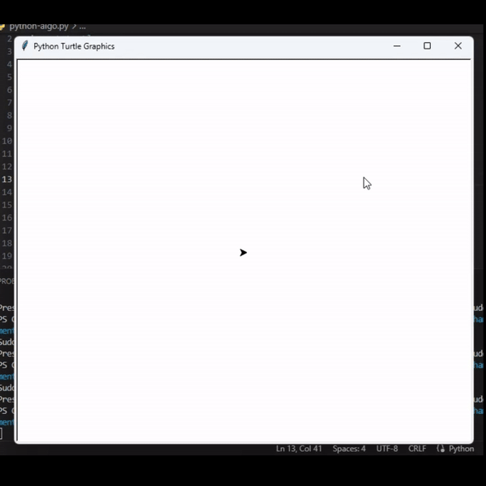

# sudoku-algorithm
A python based script for solving and generating sudoku grids using algorithms.

## Algorithm is based on 5 steps:

1.  Generate a full grid of numbers (fully filled in). This step is more complex as it seems as we cannot just randomly generate numbers to fill in the grid. We have to make sure that these numbers are positioned on the grid following the Sudoku rules. To do so will use a sudoku solver algorithm (backtracking algorithm) that we will apply to an empty grid. We will add a random element to this solver algorithm to make sure that a new grid is generated every time we run it.

2.  From our full grid, we will then remove 1 value at a time.

3.  Each time a value is removed we will apply a sudoku solver algorithm to see if the grid can still be solved and to count the number of solutions it leads to.

4.  If the resulting grid only has one solution we can carry on the process from step 2. If not we will have to put the value we took away back in the grid.

6.  We can repeat the same process (from step 2) several times using a different value each time to try to remove additional numbers, resulting in a more difficult grid to solve. The number of attempts we will use to go through this process will have an impact on the difficulty level of the resulting grid.

# Demo

